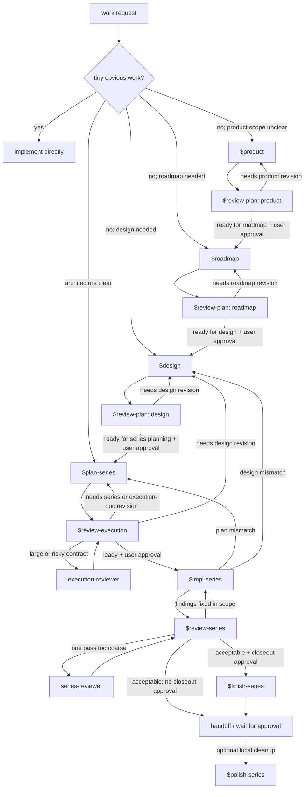

# Codex Workflow Index

This file is a human-facing index for the local Codex workflow. It is not
installed by `codex/install.sh`, and it is not a source of truth for workflow
policy.

Authoritative sources:
- `codex/AGENTS.md` defines the always-loaded baseline behavior.
- The house rules in `codex/AGENTS.md` define always-loaded docs, proof,
  commit-path, and source-ownership policy.
- `$workflow-house-rules` defines workflow-specific approval, series, planning
  artifact, finish, and history policy.
- `$product`, `$roadmap`, `$design`, and `$review-plan` own product and
  architecture planning.
- `$plan-series` and `$review-execution` own execution planning.
- `$impl-series`, `$review-series`, `$polish-series`, and `$finish-series` own
  implementation, review, local-history cleanup, and closeout.
- `$git-commit` owns commit-message mechanics.

When workflow behavior changes, update the owning skill first. Keep this file
as a short map so it does not become a second copy of the workflow rules.

## Flow graph

## Review paths

- `$review-plan` is the planning gate for product, roadmap, and design
  artifacts. It returns readiness for the next planning phase, but approval to
  move still comes from the user.
- `$review-execution` is the required gate for candidate execution contracts.
  It may use `execution-reviewer` for deeper contract review, but
  `$review-execution` keeps the readiness verdict.
- `execution-reviewer` is an optional depth tool for execution-contract
  staging. Its current focused lenses live under
  `codex/skills/workflow/exec-reviewers/`.
- `$impl-series` runs the approved current series and then runs the approved
  implementation review gate before handoff.
- `$review-series` is the default implementation review gate. It may direct a
  large or risky implemented series through `series-reviewer`.
- `series-reviewer` is the optional depth tool for implemented diffs. Its
  focused lenses live under `codex/skills/workflow/impl-reviewers/`.
- `$finish-series` records closeout only after implementation review and
  explicit closeout approval.
- `$polish-series` is optional local-history cleanup after execution is stable.
